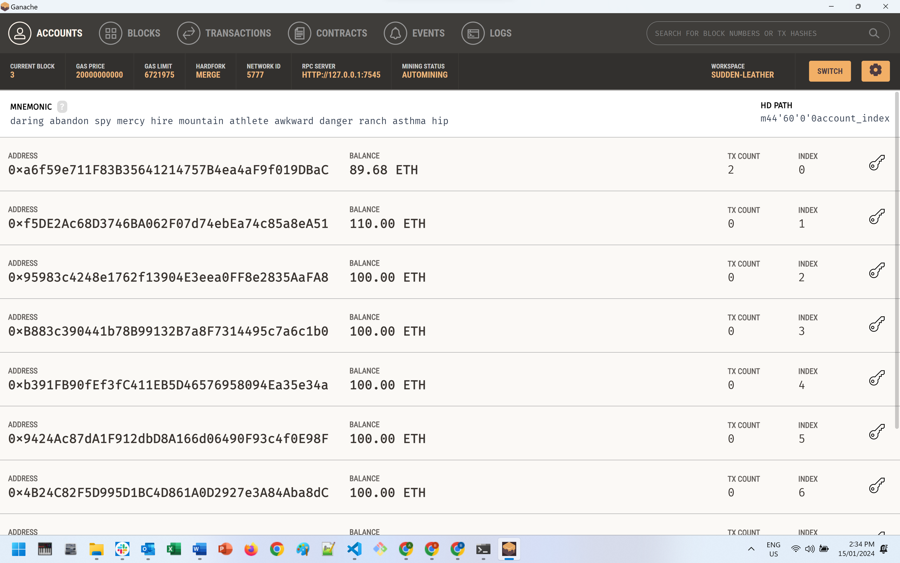
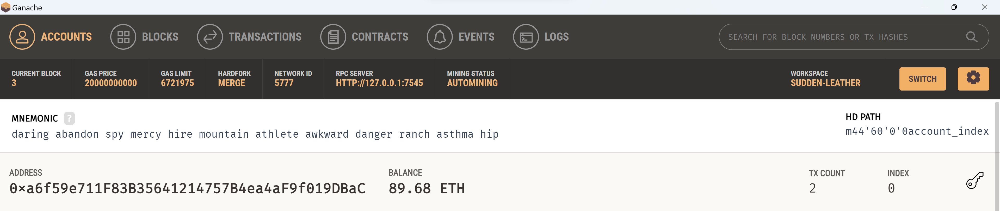
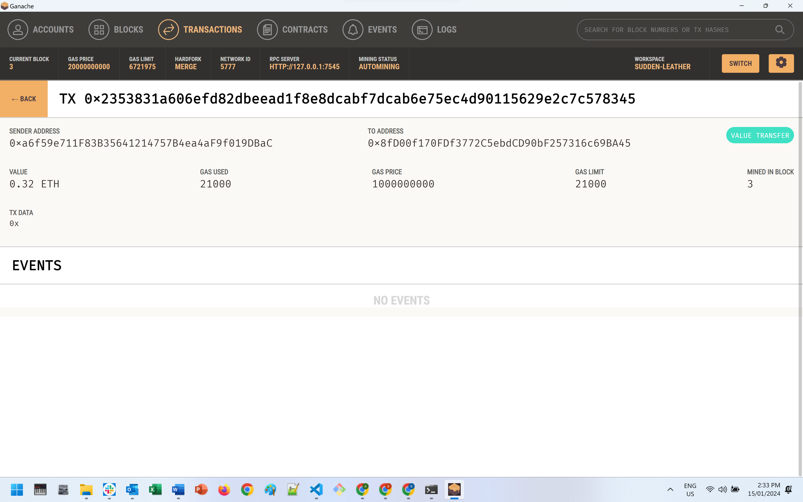

# Module_19_Blockchain_Wallets
Integrates the Ethereum blockchain network to enable instant payment to fintech professionals in cryptocurrency for their professional services.


Author: Bruno Ivasic   
Date: 16 January 2024

# Submission  
Files associated with this solution:   
* [Main Python Script: /Submission/krypto_jobs.py](./Submission/krypto_jobs.py)
* [Folder containing screen shots of output: /Submission/Screenshots](./Submission/Screenshots)


# Output Screen Shots
## Screen Shot Step 5 showing the Ganache accounts tab


## Screen Shot Step 5 showing the specific Ganache transaction account



## Screen Shot Step 6 showing the Ganache transaction detail


---

# Technologies
* Web3 API
* Streamlit

# Concepts
* Ethereum Blockchain Transactions
* Graphical User Interface (GUI) via Streamlit


# Enhancements to base starter code
* Replaced numeric indexes used to access specific columns in the candidate_database with named variables (constants) 
* Resolved runtime error caused by line 72 of crypto_wallet.py as the GasPrice was set to 0.
* Items marked as @TODO

# Dependencies
* streamlit
* bip44
* web3
* requests


# Installation / Setup
Activate a `dev` environment, e.g. `conda activate dev`, then pip install the following:
```
pip install streamlit
```

```shell
pip install web3==5.17
```


To install the **bip44**  package, check that your `dev` environment is active, and then run the following:

```shell
pip install bip44
```

# Launching
1. Ensure Ganache is active
2. In Visual Studio Code right click on `krypto_jobs.py` then select `Open in Integrated Terminal`
3. Activate the `dev` environment (e.g. `conda activate dev`)
4. Launch the app by typing `streamlit run krypto_jobs.py`


# Briefing
* [Assignment Briefing](./README.md)
