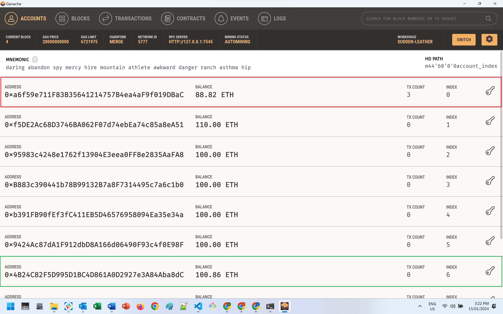

# Module_19_Blockchain_Wallets
Integrates the Ethereum blockchain network to enable instant payment to fintech professionals in cryptocurrency for their professional services.


Author: Bruno Ivasic   
Date: 16 January 2024

# Submission  
Files associated with this solution:   
* [Main Python Script: /Submission/krypto_jobs.py](./Submission/krypto_jobs.py)
* [Folder containing screen shots of output: /Submission/Screenshots](./Submission/Screenshots)


# Output Screen Shots
The screen shots below are of a payment may with the Krypto Jobs App of 4.5 Hours to Jo, who charges 0.19 ETH per hour, making a total of 0.855 ETH due in wages. Jo's (TO) Ethereum Address is 0x4B24C82F5D995D1BC4D861A0D2927e3A84Aba8dC. The client's (SENDER) Ethereum Address is 0xa6f59e711F83B35641214757B4ea4aF9f019DBaC.

---

## 1. Screen Shot of App BEFORE sending the transaction


---

## 2. Screen Shot of App AFTER sending the transaction


---

## 3. Screen Shot of Ganache accounts
The FROM account is boxed in red, and the TO account is boxed in green


The original unedited image of the above can be found here:  [Screenshot_4_Ganache_accounts.png](./Submission/Screenshots/Screenshot_4_Ganache_accounts.png)

---
## 4. Screen Shot of Ganache transaction detail


---
## 5. Screen Shot of Ganache Block History


---
## 6. Screen Shot of Ganache Block Detail


---

# Technologies
* Web3 API
* Streamlit

# Concepts
* Ethereum Blockchain Transactions
* Graphical User Interface (GUI) via Streamlit


# Enhancements to base starter code
* Items marked as @TODO
* Replaced numeric indexes used to access specific columns in the candidate_database with named variables (constants) 
* Resolved runtime error caused by line 72 of crypto_wallet.py as the GasPrice was set to 0.
* Renamed `value variable` in send_transaction function (crypto_wallet.py) to `wage_wei`  

# Dependencies
* streamlit
* bip44
* web3
* requests


# Installation / Setup
Activate a `dev` environment, e.g. `conda activate dev`, then pip install the following:
```
pip install streamlit
```

```shell
pip install web3==5.17
```


```shell
pip install bip44
```

# Launching
1. Ensure Ganache is active
2. In Visual Studio Code right click on `krypto_jobs.py` then select `Open in Integrated Terminal`
3. Activate the `dev` environment (e.g. `conda activate dev`)
4. Launch the app by typing `streamlit run krypto_jobs.py`


# Briefing
* [Assignment Briefing](./README.md)
